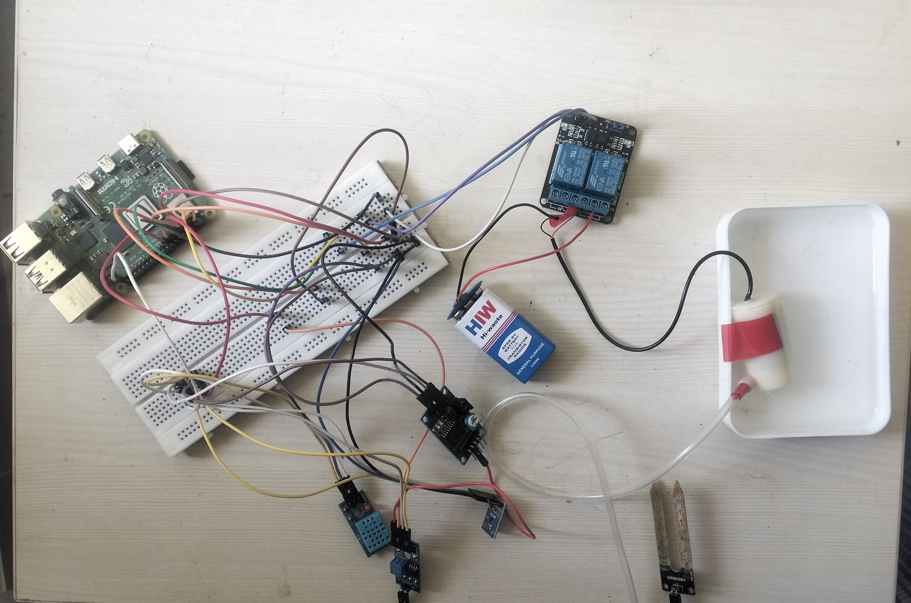
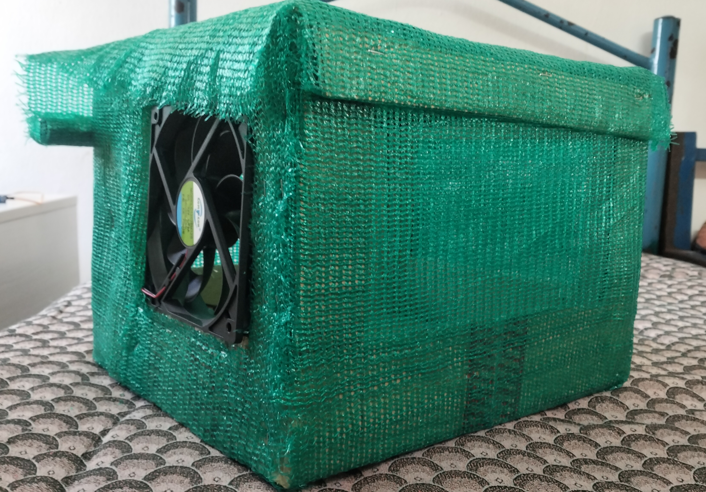
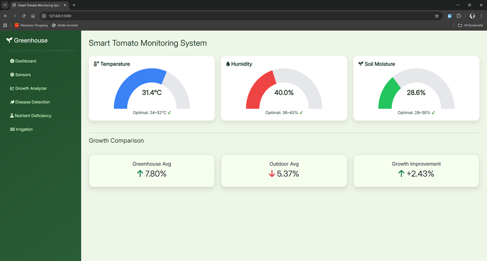
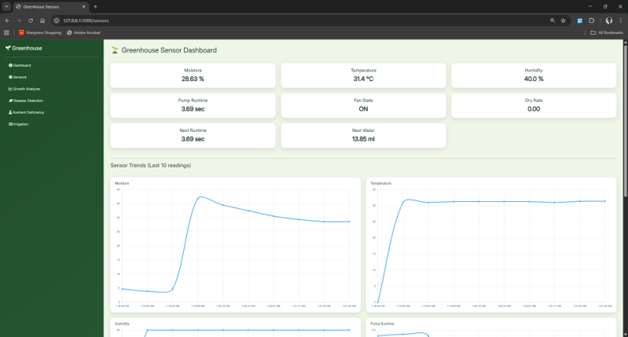
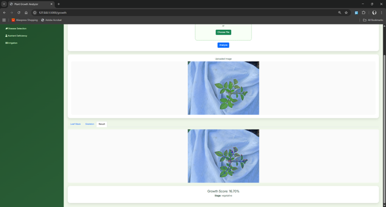
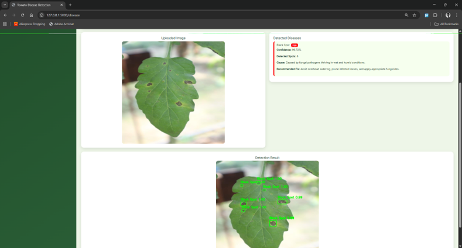
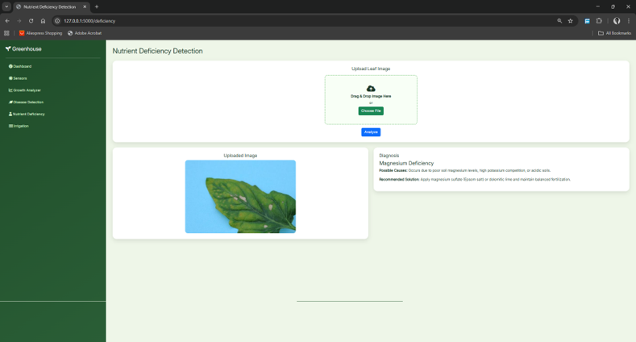
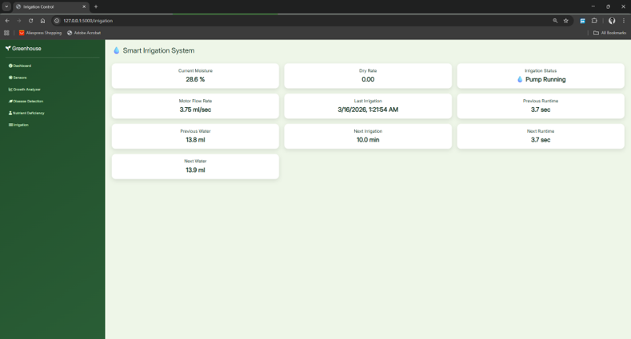

# 🌱 Automated Greenhouse Web App

This web application uses trained deep learning and computer vision models to detect plant diseases and nutrient deficiencies. It also monitors plant growth and visualizes real-time sensor data. Additionally, machine learning models predict optimal irrigation schedules, enabling efficient and data-driven farm management.

---

## 🔗 Model Training Code

This web application uses separately trained models. You can find the training code below:

- 🌿 Disease Detection (Faster R-CNN + FPN + EfficientNet-B4)  
  👉 [Disease Detection Training Code](https://github.com/sriram-mahendran/fyp-tomato_leaf_disease_localization_detection)

- 🧪 Nutrient Deficiency Detection (EfficientNet-B0)  
  👉 [Nutrient Deficiency Training Code](https://github.com/sriram-mahendran/fyp-tomato_leaf_nutrient_deficiency_classification)

- 📈 Growth Estimation (YOLO-based Detection)  
  👉 [Growth Estimation Training Code](https://github.com/sriram-mahendran/fyp-cv_growth_estimation_yolo_tomato_detection)

- 💧 Irrigation Prediction (Random Forest Model)  
  👉 [Irrigation Prediction Training Code](https://github.com/sriram-mahendran/fyp-irrigation_model_training)

---

## ⚠️ Model Weights

Due to size constraints, the following model files are not included in this repository:

- `classifier_model.pth`
- `detector_model.pth`

👉 These files are available here:  
[Google Drive Link](https://drive.google.com/drive/folders/1o69ZRhzx-y7Piha3jpoV7FIdCShSNY0y?usp=sharing)

Place them inside the `weights/` folder before running the project.


---

## 🔌 Hardware Setup & Real-Time Data Flow

This system integrates IoT hardware with the web application to enable real-time environmental monitoring and automated irrigation control.

### 🧰 Components Used

- 🍓 Raspberry Pi 4  
- 🌡️ DHT11 Temperature & Humidity Sensor (GPIO)  
- 🌱 Soil Moisture Sensor + ADC (I2C)  
- 💧 Submersible Water Pump  
- 🌬️ Ventilation Fan  
- 🔌 2-Channel Relay Module (for pump & fan control)

---

### ⚙️ Hardware Connections

- **DHT11 Sensor** → Connected via GPIO pins to read temperature and humidity  
- **Soil Moisture Sensor** → Connected through ADC using I2C communication  
- **Relay Module**:
  - Channel 1 → Water Pump  
  - Channel 2 → Ventilation Fan  
- Raspberry Pi controls actuators based on model predictions

---

### 🔄 Data Flow

1. Sensors connected to the Raspberry Pi continuously collect:
   - Temperature  
   - Humidity  
   - Soil moisture  

2. The Raspberry Pi processes this data and sends it to **ThingSpeak** using API requests  

3. The web application fetches real-time data from ThingSpeak:
   - Displays live sensor readings  
   - Updates dashboard visualizations  

4. The irrigation machine learning model uses this data to:
   - Predict optimal irrigation timing  
   - Control actuators (pump & fan)  

---

### ☁️ ThingSpeak Integration

- 📡 Data is uploaded from Raspberry Pi → ThingSpeak Channel  
- 🌐 Web app reads data via ThingSpeak API  
- 🔁 Enables real-time synchronization between hardware and dashboard  

---


---

## ⚙️ Prerequisites

Make sure you have Python installed, then install required dependencies:

```bash
pip install -r requirements.txt


```


---

## 🖼️ Proototype setup used to collect data and irrigate tomato plant.




## 📊 Dashboard

## 📊 Dashboard

## 📊 Dashboard

## 📊 Dashboard

## 📊 Dashboard

## 📊 Dashboard



